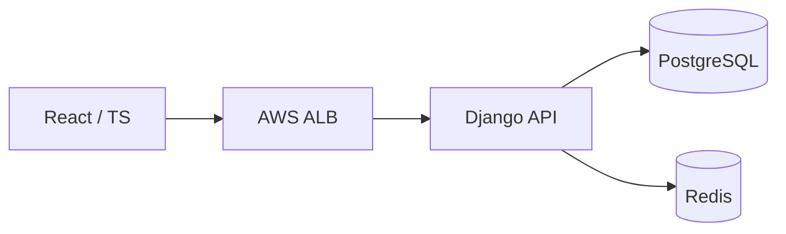
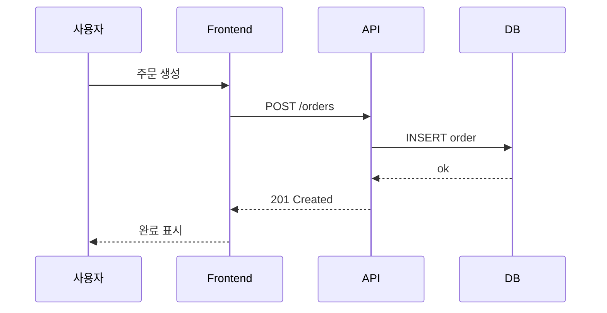

글 안에서 ` ```mermaid ` 코드블록을 쓰면 다이어그램으로 렌더링됩니다. 이미지가 아니라 텍스트라서 글과 함께 git으로 관리되고, 화살표 하나 고칠 때 텍스트만 수정하면 됩니다.

## 시스템 구성도 (flowchart)



## 요청 흐름 (sequence)



이 예시 글은 문법 참고용이니, 익숙해지면 지우거나 네 글로 바꾸면 됩니다.
